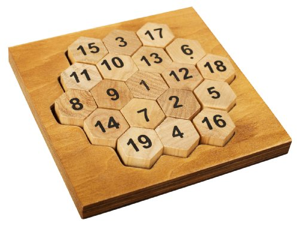

# Aristotle_Puzzle

Scala Play framework project with sbt

To find all solutions for Aristotle Puzzle(there 12 solutions),
open terminal, run command

sbt run 
 
and then open a browser and type for address 

localhost:9000

Click on "Generate Solution" button to see one from 12 solutions.

Aristotle Puzzle rules:
The rules of the game are fairly simple:

* You have 19 wooden hexagons, numbered 1-19.
* You must arrange them in the hexagonal tray, using all 19 numbers.
* All of the rows, left diagonals and right diagonals must add up to 38.

  

